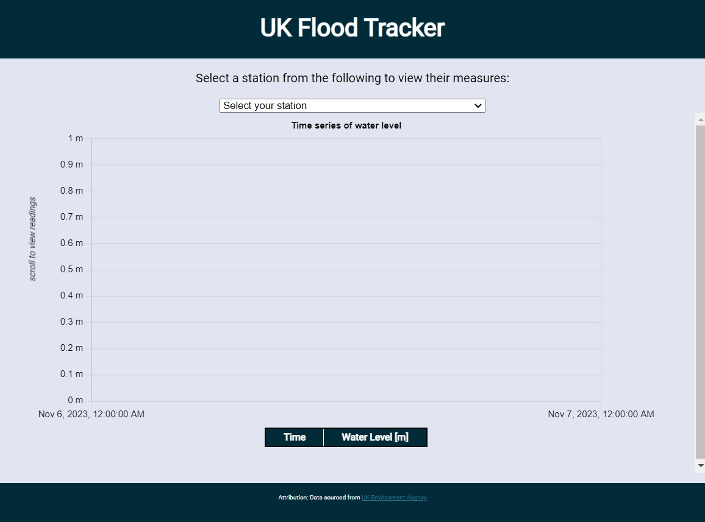

# 1. Introduction
This git repository contains the code to deploy a web application to monitor water levels in the UK using the UK National Agency's [Real Time Flood-Monitoring API](https://environment.data.gov.uk/flood-monitoring/doc/reference). When deployed, the web application should look similar to Figure 1.   

*Figure 1: A screenshot of the Web App.*




# 2. Code Builds
The project can be built either locally or on the Docker platform, but it is recommended to use Docker.

## 2.1 Local builds
For local builds, please move the config files to the parent `<root>` directory first. Next, install the pre-requisite node dependencies in the `<root>` directory through a CLI:
```
npm install
```
Deploy the website using one of the following scripts:
- `npm run dev -- --host`: For development
- `npm run build`: For deployment

## 2.2 Docker builds
The project can also be built on the Docker platform, and several configurations have been set up for different environments. 

### 2.2.1 Test
With Docker running, navigate to the `<root>` directory and run the following code in a CLI:
```
docker compose -f "./docker-compose.test.yml" up -d --build 
```
Verify if the tests pass directly in the Docker container.

### 2.2.2 Development
In the development environment, hot reloading is enabled, and any changes to the code base will be reflected immediately on the website. To start the server, navigate to the `<root>` directory and run the following code in a CLI:
```
docker-compose up -d
```
If successfully run, the website will be available at `http://localhost:3000/`

### 2.2.3 Production
With Docker running, navigate to the `<root>` directory and run the following code in a CLI:
```
docker compose -f "./docker-compose.prod.yml" up -d --build 
```
The outputs will be available in the build folder for your deployment on a server. 

If you wish to run the build locally without a server, please transfer the generated `css` and `js` file into the `index.html` file. If the `index.html` attempts to make any path references, a `Cross-Origin Resource Sharing (CORS)` error will be encountered. The final html file should look like the following:

```
<head>
  <meta charset="UTF-8" />
  <meta name="viewport" content="width=device-width, initial-scale=1.0" />
  <title>UK Flood Tracker</title>
  <style>IMPORT ALL CSS SHEETS HERE</style>
  <script type="module">IMPORT ALL JAVASCRIPT CODE HERE</script>
  ...
```